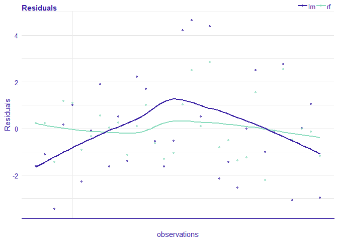

# Model verification, validation, and error analysis 

[](https://cran.r-project.org/package=auditor)

[](https://travis-ci.org/ModelOriented/auditor)
[](https://codecov.io/github/modeloriented/auditor?branch=master)
[](http://drwhy.ai/#eXtraAI)

## Overview

Package `auditor` is a tool for model-agnostic validation. Implemented
techniques facilitate assessing and comparing the goodness of fit and
performance of models. In addition, they may be used for the analysis of
the similarity of residuals and for the identification of outliers and
influential observations. The examination is carried out by diagnostic
scores and visual verification. Due to the flexible and consistent
grammar, it is simple to validate models of any classes.

`auditor` is a part of [DrWhy](drwhy.ai) collection of tools for Visual
Exploration, Explanation and Debugging of Predictive Models.

auditor’s pipeline: *model %\>% DALEX::explain() %\>% plot(type=…)*

## Installation

Stable version from CRAN:

``` r
install.packages("auditor")
```

Developer version from GitHub:

``` r
source("https://install-github.me/ModelOriented/auditor")

# or with the devtools package
devtools::install_github("ModelOriented/auditor")
```

## Demo

Run the code below or try the auditor.

``` r
library(auditor)
library(randomForest)
data(mtcars)

# fitting models
model_lm <- lm(mpg ~ ., data = mtcars)
set.seed(123)
model_rf <- randomForest(mpg ~ ., data = mtcars)

# creating objects with 'explain' function from the package DALEX
# that contains all necessary components required for further processing
exp_lm <- DALEX::explain(model_lm, data = mtcars, y = mtcars$mpg,  verbose = FALSE)
exp_rf <- DALEX::explain(model_rf, data = mtcars, y = mtcars$mpg, label = "rf", verbose = FALSE)

# create explanation  objects
mr_lm <- model_residual(exp_lm)
mr_rf <- model_residual(exp_rf)

# generating plots
plot_residual(mr_lm, mr_rf, variable = "wt", smooth = TRUE)
```

<!-- -->

## More

  - [News](NEWS.md)

  - The [website about
    auditor](https://modeloriented.github.io/auditor/)

  - A [preprint of the article about
    auditor](https://arxiv.org/abs/1809.07763) is available on arxiv.


### A short overview of plots

Column type contains character that should be passed to parameter
`type=` when using `plot()` function. `Regr` and `Class` columns
indicate whether plot can be used for regression and classification
models.

| Name of a plot                                      | Function                                                                                                  | Interactive version                                                                                        | Type                | Regr | Class |
| --------------------------------------------------- | --------------------------------------------------------------------------------------------------------- | ---------------------------------------------------------------------------------------------------------- | ------------------- | ---- | ----- |
| Autocorrelation Function                            | [plot\_acf()](https://modeloriented.github.io/auditor/reference/plot_acf.html)                            | [plotD3\_acf()](https://modeloriented.github.io/auditor/reference/plotD3_acf.html)                         | “acf”               | yes  | yes   |
| Autocorrelation                                     | [plot\_autocorrelation()](https://modeloriented.github.io/auditor/reference/plot_autocorrelation.html)    | [plotD3\_autocorrelation()](https://modeloriented.github.io/auditor/reference/plotD3_autocorrelation.html) | “autocorrelation”   | yes  | yes   |
| Influence of Observations                           | [plot\_cooksdistance()](https://modeloriented.github.io/auditor/reference/plot_cooksdistance.html)        | [plotD3\_cooksdistance()](https://modeloriented.github.io/auditor/reference/plotD3_cooksdistance.html)     | “cooksdistance”     | yes  | yes   |
| Half-Normal                                         | [plot\_halfnormal()](https://modeloriented.github.io/auditor/reference/plot_halfnormal.html)              | [plotD3\_halfnormal()](https://modeloriented.github.io/auditor/reference/plotD3_halfnormal.html)           | “halfnormal”        | yes  | yes   |
| LIFT Chart                                          | [plot\_lift()](https://modeloriented.github.io/auditor/reference/plot_lift.html)                          | [plotD3\_lift()](https://modeloriented.github.io/auditor/reference/plotD3_lift.html)                       | “lift”              | no   | yes   |
| Model Correlation                                   | [plot\_correlation()](https://modeloriented.github.io/auditor/reference/plot_correlation.html)            | \-                                                                                                         | “correlation”       | yes  | yes   |
| Principal Component Analysis of Models              | [plot\_pca()](https://modeloriented.github.io/auditor/reference/plot_pca.html)                            | \-                                                                                                         | “pca”               | yes  | yes   |
| Model Ranking Radar Plot                            | [plot\_radar()](https://modeloriented.github.io/auditor/reference/plot_radar.html)                        | \-                                                                                                         | “radar”             | yes  | yes   |
| Predicted Response vs Actual or Variable Values     | [plot\_prediction()](https://modeloriented.github.io/auditor/reference/plot_prediction.html)              | [plotD3\_prediction()](https://modeloriented.github.io/auditor/reference/plotD3_prediction.html)           | “prediction”        | yes  | yes   |
| Regression Error Characteristic Curve (REC)         | [plot\_rec()](https://modeloriented.github.io/auditor/reference/plot_rec.html)                            | [plotD3\_rec()](https://modeloriented.github.io/auditor/reference/plotD3_rec.html)                         | “rec”               | yes  | yes   |
| Plot Residuals vs Actual, Fitted or Variable Values | [plot\_residual()](https://modeloriented.github.io/auditor/reference/plot_residual.html)                  | [plotD3\_residual()](https://modeloriented.github.io/auditor/reference/plotD3_residual.html)               | “residual”          | yes  | yes   |
| Residual Boxplot                                    | [plot\_residual\_boxplot()](https://modeloriented.github.io/auditor/reference/plot_residual_boxplot.html) | \-                                                                                                         | “residual\_boxplot” | yes  | yes   |
| Residual Density                                    | [plot\_residual\_density()](https://modeloriented.github.io/auditor/reference/plot_residual_density.html) | \-                                                                                                         | “residual\_density” | yes  | yes   |
| Receiver Operating Characteristic (ROC) Curve       | [plot\_roc()](https://modeloriented.github.io/auditor/reference/plot_roc.html)                            | \-                                                                                                         | “roc”               | no   | yes   |
| Regression Receiver Operating Characteristic (RROC) | [plot\_rroc()](https://modeloriented.github.io/auditor/reference/plot_rroc.html)                          | \-                                                                                                         | “rroc”              | yes  | yes   |
| Scale-Location Plot                                 | [plot\_scalelocation()](https://modeloriented.github.io/auditor/reference/plot_scalelocation.html)        | [plotD3\_scalelocation()](https://modeloriented.github.io/auditor/reference/plotD3_scalelocation.html)     | “scalelocation”     | yes  | yes   |
| Two-sided Cumulative Distribution Function          | [plot\_tsecdf()](https://modeloriented.github.io/auditor/reference/plot_tsecdf.html)                      | \-                                                                                                         | “tsecdf”            | yes  | yes   |


###  Acknowledgments
Work on this package was financially supported by
    the ‘NCN Opus grant 2016/21/B/ST6/02176’.
